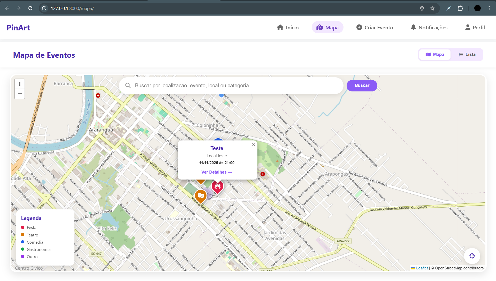

# 📌 PinArt - Descubra Eventos Incríveis



O **PinArt** é uma plataforma web desenvolvida em Django para conectar organizadores de eventos aos usuários finais. O sistema permite descobrir eventos por localização (mapa interativo), categoria e nome, além de gerenciar inscrições e feedback.

---

## 🚀 Funcionalidades

### 👤 Usuários e Perfis
- **Cadastro Duplo:** Contas separadas para Organizadores e Participantes.
- **Perfil Completo:** Gerenciamento de foto de perfil (upload via Cloudinary) e dados pessoais.

### 📅 Eventos
- **Criação de Eventos:** Organizadores podem criar eventos com data, local e imagem de capa.
- **Busca Inteligente:** Filtros por texto, localização e categoria simultaneamente.
- **Sistema de Presença:** Usuários confirmam ou cancelam presença com um clique.
- **Avaliações:** Sistema de comentários e notas (1 a 5 estrelas) para eventos passados.

### 🗺️ Geolocalização (Mapas)
- **Mapa Interativo:** Integração com **Leaflet.js** e **OpenStreetMap**.
- **Clusterização:** Agrupamento automático de eventos próximos.
- **Busca Visual:** Ícones personalizados no mapa de acordo com a categoria do evento (Festa, Teatro, Gastronomia, etc.).
- **Geolocalização:** Botão para encontrar eventos próximos à posição atual do usuário.

---

## 🛠️ Tecnologias Utilizadas

- **Backend:** Python 3.9+, Django 5.x
- **Frontend:** HTML5, CSS3 (Responsivo), JavaScript
- **Mapas:** Leaflet.js, MarkerCluster, ViaCEP API (para preenchimento de endereço)
- **Mídia:** Cloudinary (Armazenamento de imagens na nuvem)
- **Banco de Dados:** PostgreSQL
- **Outros:** FontAwesome (Ícones)

---

## ⚙️ Como rodar o projeto localmente

Siga os passos abaixo para configurar o ambiente de desenvolvimento na sua máquina.

### Pré-requisitos
Antes de começar, você precisa ter instalado em sua máquina:
* [Python 3.9+](https://www.python.org/downloads/)
* [Git](https://git-scm.com/downloads)

### 1. Clone o repositório
Abra o terminal e rode o comando:
```bash
git clone https://github.com/RqfaelJr/pinart.git
cd pinart
```
### 2. Crie e ative o Ambiente Virtual

Isso isola as dependências do projeto.

**No Windows:**

```bash
python -m venv venv
.\venv\Scripts\activate
```

**No Linux ou Mac:**

```bash
python3 -m venv venv
source venv/bin/activate
```

*(Se der certo, você verá `(venv)` no começo da linha do terminal)*.

### 3\. Instale as dependências

Com o ambiente virtual ativo, instale as bibliotecas listadas no `requirements.txt`:

```bash
pip install -r requirements.txt
```

### 4\. Configuração das Variáveis de Ambiente (.env)

O projeto utiliza variáveis de ambiente para segurança (chaves do Cloudinary e Django).

1.  Crie um arquivo chamado `.env` na **raiz** do projeto (onde está o arquivo `manage.py`).
2.  Copie e cole o conteúdo abaixo dentro dele, preenchendo com seus dados:


```env
# Configurações do Django
DEBUG=True
SECRET_KEY=digite_uma_chave_secreta_aqui
ALLOWED_HOSTS=127.0.0.1,localhost

# Configurações do Cloudinary (Imagens)
# Crie uma conta grátis em [https://cloudinary.com](https://cloudinary.com) para obter estas chaves:
CLOUD_NAME=seu_cloud_name
CLOUD_API_KEY=sua_api_key
CLOUD_API_SECRET=sua_api_secret
```

### 5\. Prepare o Banco de Dados

Crie as tabelas necessárias no banco de dados SQLite:

```bash
python manage.py makemigrations
python manage.py migrate
```

### 6\. Crie um Superusuário (Opcional)

Para acessar o painel administrativo do Django (`/admin`):

```bash
python manage.py createsuperuser
```

### 7\. Inicie o Servidor

Tudo pronto\! Agora é só rodar:

```bash
python manage.py runserver
```

📍 O projeto estará rodando em: `http://127.0.0.1:8000/`

```
